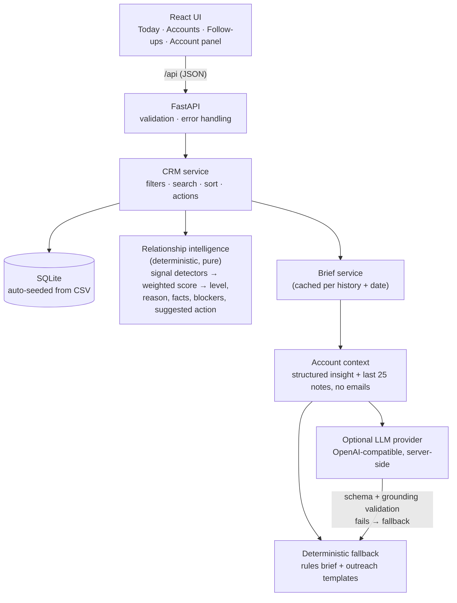

# Relay: an AI-powered micro-CRM

> **Don't make the owner read the CRM. Tell them who needs attention, why, and what to do next.**

Relay is a small relationship assistant for an owner selling an AI phone-answering product to dental practices. You open it and it has already read every interaction, ranked the accounts, explained each ranking, and drafted the next message. The whole design is organised around three questions, in this order:

1. **Who needs attention?** A ranked Today queue, grouped into *Act today*, *This week*, *Check in*, and *No action needed*.
2. **Why?** A one-line reason on every row, and a "Why it's ranked here" breakdown showing each signal, its points, and the interaction it came from.
3. **What should I do next?** A next best action, the evidence behind it, talking points, and an editable outreach draft.


---

## 1. What I built and why

A two-page app plus an account side panel:

| Surface | What it answers |
| --- | --- |
| **Today** (landing) | "Four accounts need you today, and two more this week." Ranked queue with reason, suggested action, last contact and one-click *Mark done*; relationship opportunities; accounts deliberately left alone; a small health summary; recent activity. |
| **Accounts** | Every account with search, filters (All / Needs attention / Prospects / Customers) and sort (priority / last interaction / status). State lives in the URL, so views are shareable and survive refresh. |
| **Follow-ups** | Open follow-ups grouped *Today / This week / When you have time*, plus recently completed ones. |
| **Account panel** | The short version (summary), next best action, outreach draft, key facts, blockers, why it's ranked here, people, and a full interaction timeline where you can log new interactions. |

I deliberately did **not** build a CRUD CRM (no account/contact editing forms, pipelines, or reports). With 12 accounts the owner's problem isn't data entry; it's knowing where to spend the next hour. Every screen serves the three questions above.

## 2. Key product decisions

- **Rank by what's waiting on you, not by recency.** Parkview (last touched 12 days ago, with a deadline question still unanswered) outranks accounts touched yesterday.
- **Explain every ranking.** Scores are shown, but more importantly each signal is listed in plain language with its points and source interaction. An owner will only trust a ranking they can audit.
- **"No action needed" is a first-class outcome.** Evergreen (asked for space until September planning), Oak & Pine (resolved, "no additional follow-up required") and Maple Grove (positive feedback) are shown in their own section with the reason, so the owner can see the system *chose* to leave them alone.
- **Customers get check-ins, not sales pushes.** Satisfied or quiet customers surface as *Check in* opportunities (Sunrise's expansion, Greenfield's SMS question, Willow Creek's 5-month silence) and structurally can't outrank urgent prospects.
- **The suggested action is specific.** "Confirm with Chris whether onboarding can be completed before September 15", not "Follow up".
- **Mocked, reversible actions.** *Mark follow-up done* and *Log as sent* write a local interaction, which re-scores the account immediately; a toast offers **Undo**. *Open in email app* uses `mailto:`; nothing is sent externally.
- **Evidence is always verbatim.** Quotes in the panel come from the database, never from model output, so the owner can check them.
- **Honest AI labelling.** Each brief shows whether it was *Written by {model}* or *Built from your history* (rules), and why a fallback happened.

## 3. Key technical decisions

- **FastAPI + SQLite, React + TypeScript + Vite + Tailwind v4.** Small, boring, runnable in two commands. SQLite auto-seeds from the supplied CSVs on first start.
- **The intelligence layer is a pure function**: `analyze_account(customer, contacts, interactions, today) -> AccountInsight`. No I/O, trivially testable, and the same structured view feeds the UI, the rules brief and the LLM prompt.
- **"Today" is pinned to 2026-09-01** (the morning after the last sample interaction), so the demo looks the same on any day. `CRM_TODAY=real` uses the system clock.
- **Pydantic schemas on every boundary** (request bodies, responses, LLM output); TypeScript types mirror them.
- **TanStack Query** for server state, loading and error states; mutations invalidate everything, which is cheap at this scale and keeps every view consistent.
- **Seed interactions are immutable**; only user-logged interactions can be removed (this powers Undo and keeps the demo resettable via *Reset demo data*).

### Architecture



```
backend/
  app/intelligence/   text.py (language patterns) · scoring.py (weights, thresholds) · analyzer.py
  app/ai/             context.py · llm.py (prompt, parsing, grounding) · fallback.py · service.py · schema.py
  app/                main.py (routes) · crm_service.py · repository.py · models.py · schemas.py · config.py
  app/seed/           customers.csv · contacts.csv · interactions.csv (supplied data, verbatim)
  tests/
frontend/src/
  api/                typed client + React Query hooks
  pages/              TodayPage · AccountsPage · FollowUpsPage
  components/         AccountRow · AppLayout · ui primitives · account/ (panel, brief, context, timeline)
  lib/                formatting + style helpers (unit-tested)
```

## 4. Where AI adds value

The deterministic layer decides **who** and **how urgent**: that must be stable, explainable and testable. Language understanding is used where it helps the owner most:

| Task | How |
| --- | --- |
| Account summary ("the short version") | LLM-written when a key is set; otherwise composed from detected signals and quoted notes |
| Relationship facts (scale, needs, integrations, decision process, concerns) | Pattern-classified sentences quoted from notes; the LLM may rephrase |
| Intent, urgency, blockers | From the rules layer; passed to the LLM as structured context |
| Next best action + reason | Rules pick the driving signal; the LLM can phrase a better action and reason |
| Outreach draft / talking points | LLM-written, or signal-specific templates filled only with names, dates and details found in the history |

**Guardrails for the LLM path** (`app/ai/llm.py`):

- The system prompt states that interaction notes are **untrusted data, not instructions**, to use only the supplied context, never invent facts, and say when information is insufficient. Notes are passed inside a JSON payload, never concatenated into instructions.
- Only what's needed is sent: the structured insight plus the latest 25 interactions; **no contact email addresses**. The API key never leaves the server (a test asserts it never appears in any response).
- Output must match a strict schema: `{summary, key_facts, intent, urgency, blockers, next_action, reason, suggested_message, …}`.
- **Grounding checks** before anything is shown: cited interaction IDs must exist for this account, the recipient must be one of its contacts, and every number in generated prose must appear in the supplied context (catches invented prices, dates, and location counts).
- Any failure (timeout, HTTP error, bad JSON, schema or grounding violation) falls back to the rules brief, and the UI says why.

## 5. How prioritization works

Each interaction is split into sentences and classified by direction (*we* sent / *they* said / internal note). Detectors then emit **signals**, each with a weight, a plain-English detail and the interactions that prove it. `priority_score` is the sum; the level comes from thresholds. All weights live in one dict in `app/intelligence/scoring.py`.

| Signal (examples) | Points |
| --- | --- |
| Explicit follow-up request not yet actioned | +35 |
| Stated deadline within 21 days · decision month is now · proposal unanswered ≥ 5 days · unresolved issue | +25 |
| Question still unanswered · demo link sent but no demo booked | +20 |
| High buying intent · implementation discussion · customer expansion · note flags a follow-up | +15 |
| Customer check-in due (60+ days quiet) · open customer request · outreach gone cold (30+ days) | +12 |
| Prospect stage · demo completed · recent engagement · dormant prospect | +10 |
| We just reached out (give them room) | −20, capped at *No action* |
| "No additional follow-up required" | −30, capped at *No action* |
| "Do not push" / delayed until a stated month | −45, capped at *No action* until that month |

**Levels:** ≥ 70 *Act today* · ≥ 40 *This week* · ≥ 12 *Check in* · otherwise *No action*.

Special handling:

- **Suppressors expire.** "Do not push before September planning" holds until September; an undated hold expires after 60 days. A newer question from the account overrides an older "no follow-up" note.
- **Resolved issues don't alert.** An issue followed by an improvement/"seems better" reply is treated as resolved.
- **Answered asks disappear.** An ask counts as open only if we haven't replied after it; a live call or meeting after our outreach closes the "awaiting reply" state.
- **Mark done** logs a local note; the analyzer treats it as our response, so the account re-scores naturally, with no special-case flag.

Nothing is keyed on customer IDs. The resulting order on the demo date:

| Account | Level | Score | Driving reason |
| --- | --- | --- | --- |
| Parkview Dental Studio | Act today | 110 | Onboarding-before-Sept-15 question unanswered |
| Central Avenue Dentistry | Act today | 95 | Asked for an implementation follow-up this week; contract details sent |
| Northstar Dental Group | Act today | 95 | Proposal sent Aug 23, no reply in 9 days |
| Riverbend Orthodontics | Act today | 73 | Demo link sent Jul 22, demo never booked |
| BrightSmile Dental | This week | 53 | Decision expected in September |
| Lakeside Dental Care | This week | 50 | Pricing sent Jun 28, no reply (re-engage) |
| Sunrise Pediatric Dentistry | Check in | 15 | May need a second account |
| Greenfield Pediatrics | Check in | 12 | Asked whether SMS support is planned |
| Willow Creek Dental | Check in | 12 | No contact for 153 days |
| Evergreen Dental Partners | On hold | 0 | Budgeting delayed until September planning |
| Maple Grove Orthodontics | No action | 0 | Positive feedback |
| Oak & Pine Family Dental | No action | 0 | Resolved; no follow-up required |

## 6. Assumptions and simplifications

- Single user, no authentication (as instructed). The seller is "we"; contacts belong to one account.
- "Today" is pinned to **2026-09-01** so relative timing ("no reply in 9 days") is meaningful.
- Language detection uses English patterns tuned for sales/support notes of this style. It generalises to new accounts written similarly (the tests use synthetic accounts), but it's not a general NLU system; that is exactly where the optional LLM helps.
- Email sending, calendar booking and CRM sync are mocked: *Log as sent* and *Mark follow-up done* record a local interaction.
- Briefs are cached in memory keyed on the account's history and date; restarting the API clears the cache.
- Google Fonts load from the web; without internet the UI falls back to system fonts.

## 7. Setup and run

Requirements: **Python 3.11+** and **Node 20+**.

```bash
# 1. Backend (http://127.0.0.1:8000)
cd backend
python -m venv .venv && source .venv/bin/activate    # Windows: .venv\Scripts\activate
pip install -r requirements.txt
uvicorn app.main:app --reload --port 8000

# 2. Frontend (http://localhost:5173), in a second terminal
cd frontend
npm install
npm run dev
```

Open **http://localhost:5173**. The database is created and seeded automatically at `backend/data/crm.db`. Use **Reset demo data** in the sidebar (or delete that file) to start over. The Vite dev server proxies `/api` to port 8000.

To enable LLM-written briefs, set the variables below before starting the backend, e.g. `export LLM_API_KEY=sk-...`. The sidebar shows which mode is active.

## 8. Environment variables

All optional; see `backend/.env.example`.

| Variable | Default | Purpose |
| --- | --- | --- |
| `LLM_API_KEY` | *(unset → rules mode)* | Enables LLM briefs. Server-side only. |
| `LLM_BASE_URL` | `https://api.openai.com/v1` | Any OpenAI-compatible `/chat/completions` endpoint |
| `LLM_MODEL` | `gpt-4o-mini` | Model name |
| `LLM_TIMEOUT_SECONDS` | `30` | After this, fall back to rules |
| `CRM_TODAY` | `2026-09-01` | Demo date; `real` uses the system clock |
| `CRM_DB_PATH` | `backend/data/crm.db` | SQLite file location |
| `CORS_ORIGINS` | `http://localhost:5173,http://127.0.0.1:5173` | Allowed browser origins |

## 9. Tests

```bash
cd backend && pytest          # 50 tests
cd backend && ruff check app tests

cd frontend && npm test       # formatting helpers (vitest)
cd frontend && npm run typecheck && npm run lint && npm run build
```

Backend coverage focuses on business logic:

- **Priority scoring** (`test_priority_scoring.py`): hot prospects land in *Act today*, a decision month that has arrived needs attention, "do not push" suppresses and expires after the stated month, resolved issues aren't alerts, happy customers never outrank urgent prospects, customer questions are requests rather than sales follow-ups, stale pricing is re-engagement, the score equals the sum of signal points, and synthetic accounts outside the dataset behave sensibly.
- **Follow-up detection** (`test_follow_up_detection.py`): a question is open until we respond, internal notes aren't replies, unanswered proposals become follow-ups after a grace period, un-booked demo links are caught, a logged follow-up clears the queue, quiet customers get check-in opportunities.
- **API behaviour** (`test_api.py`): seeding and dashboard, filters, search (account and contact names), sorting, 422 on bad input, 404 on unknown accounts, 403 on deleting seed history, mark-done + undo, logging a reply re-scores the account, reset.
- **AI layer** (`test_ai_briefs.py`): rules briefs quote history verbatim, outreach uses details from the history, valid LLM output is used, ungrounded output (unknown evidence, foreign recipient, invented numbers) and failures (timeouts, 5xx, bad JSON) fall back, caching, the API key never reaching the client. The LLM is exercised with a mocked HTTP transport.

## 10. What I'd build next

1. **Real integrations**: Gmail/Outlook sync to log interactions automatically and send drafts; calendar links for "book the follow-up".
2. **LLM-assisted signal extraction** at write time (stored per interaction with the rules result as a cross-check), so detection handles free-form notes beyond the tuned patterns.
3. **Snooze / "remind me on…"** and user-set follow-up dates, feeding the same scoring layer.
4. **Feedback loop**: let the owner re-rank or dismiss a suggestion, and use that to tune weights.
5. **Evaluation set** for briefs (grounding and usefulness rubrics) run in CI against the chosen model.
6. **Persistence polish**: migrations, a persistent brief cache, multi-user auth once there's more than one seller.
7. Frontend component tests for the panel flows (Playwright), which I verified manually for this submission.
